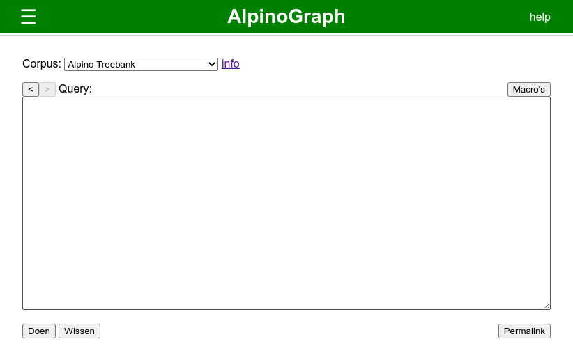
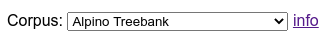
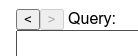
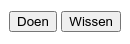
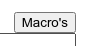
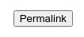

# Overzicht van AlpinoGraph

## Startscherm

Hieronder zie je het startscherm van AlpinoGraph.

 

Linksboven vind je een menu met een groot aantal query's.
Klik op een titel, en de bijbehorende query wordt naar het invoerveld gekopieerd.

Onder het kopje ^^Voorbeelden^^ vind je simpele voorbeelden van de
verschillende dingen waarnaar je kunt zoeken.

Onder het kopje ^^SPOD^^ vind je... TODO.

 

Je kunt kiezen uit een groot aantal corpora om de query op uit te
voeren. Corpora van klein naar groot, met of zonder metadata,
handmatig of automatisch geannoteerd. Klik op ^^info^^ voor
een beschrijving van elk corpus.

 

Boven het invoerveld staan pijlen waarmee je kunt bladeren door
eerdere query's.

 

Klik op ^^Doen^^ om de query in het invoerveld uit te voeren, of op
^^Wissen^^ om het invoerveld leeg te maken.

 

Klik op ^^Macro's^^ om de invoer van macro-definities te openen. Zie [beneden](#macros).

 

Wanneer je op ^^Permalink^^ klikt krijg je de mogelijkheid om een URL
te kopiëren naar AlpinoGraph waarin de huidige query uit het
invoerveld, en de keus van het corpus is gecodeerd. Je kunt deze URL
gebruiken om elders naar deze query terug te verwijzen.

 

## Zoekresultaten

TODO

TODO: Bladeren door pagina's werkt niet zoals je zou verwachten.

TODO: Uitleggen hoe ontdubbelen onder de knoppen `tabel` en `zinnen`
anders werkt dan onder `woorden` en `lemma's`, waardoor de aantallen
kunnen verschillen.

## Macro's

